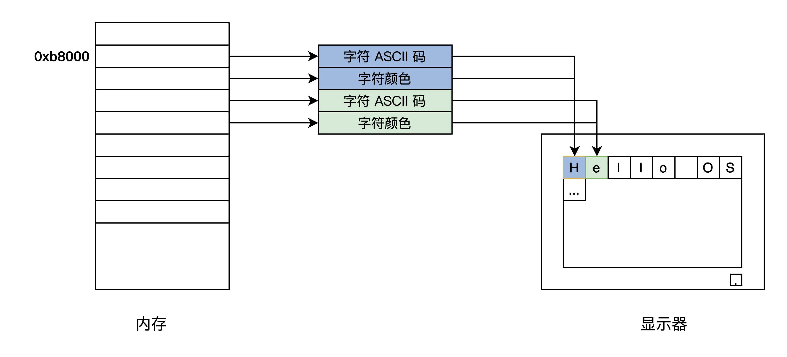

## 计算机启动过程

BIOS 固件是固化在主板的 ROM 芯片上，因此不通电也能保存。第一条指令就保存在这。

第一条指令的作用是检测和初始化 CPU、内存及主板平台，然后加载引导设备（通常是硬盘）中的第一个扇区数据，到 `0x7c00`地址的内存空间，再接着跳转到`0x7c00`处执行指令。

## 代码解释

### Hello OS 引导汇编代码

`entry.asm`中:

1. 代码 1~40 行，用汇编定义的 GRUB 的多引导协议头，其实就是一定格式的数据，我们的 Hello OS 是用 GRUB 引导的，当然要遵循 GRUB 的多引导协议标准，让 GRUB 能识别我们的 Hello OS。之所以有两个引导头，是为了兼容 GRUB1 和 GRUB2。
2. 代码 44~52 行，关掉中断，设定 CPU 的工作模式。你现在可能不懂，没事儿，后面 CPU 相关的课程我们会专门再研究它。
3. 代码 54~73 行，初始化 CPU 的寄存器和 C 语言的运行环境。
4. 代码 78~87 行，GDT_START 开始的，是 CPU 工作模式所需要的数据，同样，后面讲 CPU 时会专门介绍。

### Hello OS 主函数

`main.c` 现在不是应用程序的`main`函数，而是 Hello OS 的`main`函数。

同时 `printf` 函数也需要自己实现。

### 控制计算机屏幕

无论显卡类型是什么，都支持 VESA 标准。这种标准下有两种工作模式：字符模式和图形模式。

各种显卡为了兼容这个标准，都提供了 VGBIOS 的固件程序。

显卡工作细节：

- 字符模式：把屏幕分成 24 行，每行 80 个字符，把这（24\*80）个位置映射到以 0xb8000 地址开始的内存中，每两个字节对应一个字符，其中一个字节是字符的 ASCII 码，另一个字节为字符的颜色值。

### 编译和安装 Hello OS

通过`makefile`对 Hello OS 代码进行编译，之所以需要编译工具是因为当工程复杂度上升，代码量越来越大的时候也会使得编译过程变得愈加复杂。

因此通过 `makefile`这样的编译工具，不仅可以降低编译复杂度，还可以在编译过程中加入个性化设置。

